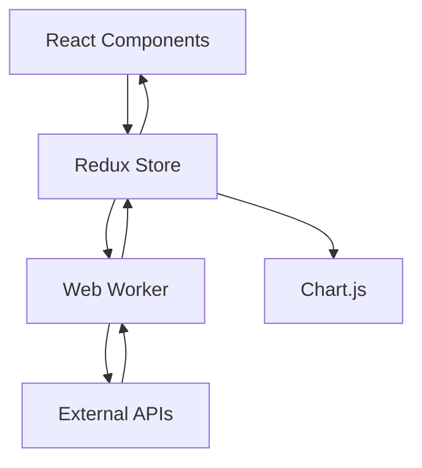

# AI Redux ChartJS Boilerplate

This project uses [Vite](https://vitejs.dev/), React and Redux Toolkit to experiment with Chart.js visualisations and background model training via Web Workers.

## Local Setup

Ensure you have Node.js **18+** (tested with v20.19.4) and [PNPM](https://pnpm.io/) **8+** (tested with v10.5.2). If PNPM is not available, enable it via [Corepack](https://nodejs.org/api/corepack.html):

```bash
corepack enable pnpm
```

Install dependencies:

```bash
pnpm install
```

## Scripts

Run these with `pnpm`:

- `pnpm dev` – start the Vite development server.
- `pnpm build` – create a production build in `dist/`.
- `pnpm preview` – preview the production build locally.
- `pnpm test` – execute the test suite with Vitest.
- `pnpm lint` – run ESLint against the codebase.

## Architecture Overview



For further details consult the [Vite](https://vitejs.dev/), [Redux Toolkit](https://redux-toolkit.js.org/) and [Chart.js](https://www.chartjs.org/docs/) documentation.

### State flow
The Redux store combines UI and domain slices along with RTK Query APIs. Components dispatch actions and select state from `src/app/store.js`.

### Worker protocol
Model training occurs in `src/workers/trainBrain.worker.js`. The worker expects `{ series, hyperparams, norm }` and posts `{ progress }` updates. When complete it sends `{ done: { modelJSON, norm } }` or `{ error }` on failure.

### Chart composition
Chart behaviour is centralised in `src/charts/config.ts` and `src/charts/datasets.ts` which provide reusable Chart.js configuration and dataset helpers.

### Content Security Policy (CSP)
Deploying with a restrictive CSP is recommended:

```
Content-Security-Policy: default-src 'self'; script-src 'self'; worker-src 'self'; style-src 'self' 'unsafe-inline'; img-src 'self' data:; connect-src 'self'
```

Adjust `connect-src` for any external APIs and avoid `unsafe-eval` to keep worker execution safe.

## Environment Variables

Vite exposes only variables prefixed with `VITE_` to client code. Create a `.env` or `.env.local` file in the project root and define values such as:

```
VITE_API_URL=https://api.example.com
VITE_BINANCE_BASE_URL=https://api.binance.com/api/v3/
```

Access them via `import.meta.env.VITE_API_URL`. `marketApi` reads `VITE_BINANCE_BASE_URL` to configure the Binance API base URL, falling back to Binance's public endpoint if the variable is missing.

## Contribution Workflow

1. Fork and clone the repository.
2. Create a feature branch.
3. Install dependencies with `pnpm install`.
4. Run `pnpm lint` and `pnpm test` to ensure code quality.
5. Commit your changes and open a pull request.

## Deployment

1. Configure any required environment variables.
2. Build the production bundle:

   ```bash
   pnpm build
   ```

3. Deploy the contents of the `dist/` directory to your static host (e.g. Netlify, Vercel or an S3 bucket).

Use `pnpm preview` to test the production build locally before deploying.

## Screenshots

### Overview


### Model Lab


